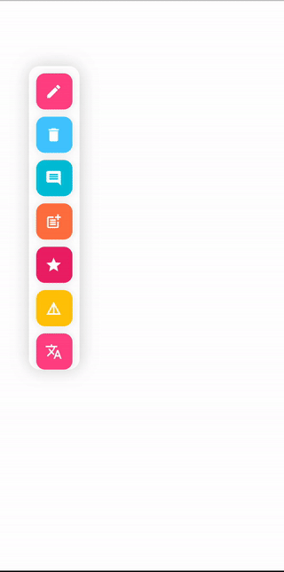

# 👏 Flutter ToolBar [](https://opensource.org/licenses/MIT)

[](https://ko-fi.com/zuyenz)

<p>A flutter package which display the library is a library with dynamic toolbars and beautiful animation ...</p>

The source code is **100% Dart**, and everything resides in the [/lib](https://github.com/ThuyenPV/flutter_toolbar/tree/main/lib) folder.

# 🔅 Gifs

                                                                                                                                                        |                                                                                                                                                          |                                                                                                                                                          |

# 💻 Installation

In the `dependencies:` section of your `pubspec.yaml`, add the following line:

```yaml
dependencies:
  flutter_toolbar: <latest version>
```

# ❔ Usage

### Import this class

```dart
import 'package:flutter_toolbar/flutter_toolbar.dart';
```

### Flutter ToolBar

```dart
    FlutterToolbar(
        toolbarItems: [
            ToolbarItemData(
                title: 'Edit',
                color: Colors.pinkAccent,
                icon: Icons.edit,
            )
        ],
    ),
```

# 👍 How to Contribute

1. Fork it
2. Create your feature branch (git checkout -b my-new-feature)
3. Commit your changes (git commit -am 'Add some feature')
4. Push to the branch (git push origin my-new-feature)
5. Create new Pull Request

## Support us

You can support us by becoming a patron on Patreon, any support is much appreciated.

[](https://www.patreon.com)